# FSE_Projeto1

## Dados

| Aluno | Matrícula |
| --- | --- |
| Alexandre Miguel Rodrigues Nunes Pereira | 16/0000840 |

## Introdução

O Projeto em questao busca realizar o controle de temperatura de um sistema isolado, acionando uma ventoinha para o resfriamento do sistema até a **Temperatura Externa** e um resistor para aquecer a **Temperatura Interna** até a **Temperatura de Referência**, como descrito no repositório do projeto em [https://gitlab.com/fse_fga/projetos_2020_2/projeto-1-2020.2](https://gitlab.com/fse_fga/projetos_2020_2/projeto-1-2020.2).

## Dependências

* [WiringPi](http://wiringpi.com/)
* [ncurses](https://invisible-island.net/ncurses/announce.html)

## Execução

Para executar o programa basta clonar o repositório presente, entrar no diretório do repositório e executar os seguintes comandos

``` bash
# Clone do repositório
$ git clone https://github.com/aleronupe/FSE_Projeto1

# Vá para o diretório do projeto
$ cd FSE_Projeto1/

# Relize o build o projeto
$ make

# Inicie a execução
$ make run
```

Com a execução do comando ```make``` é esperado o seguinte resultado:

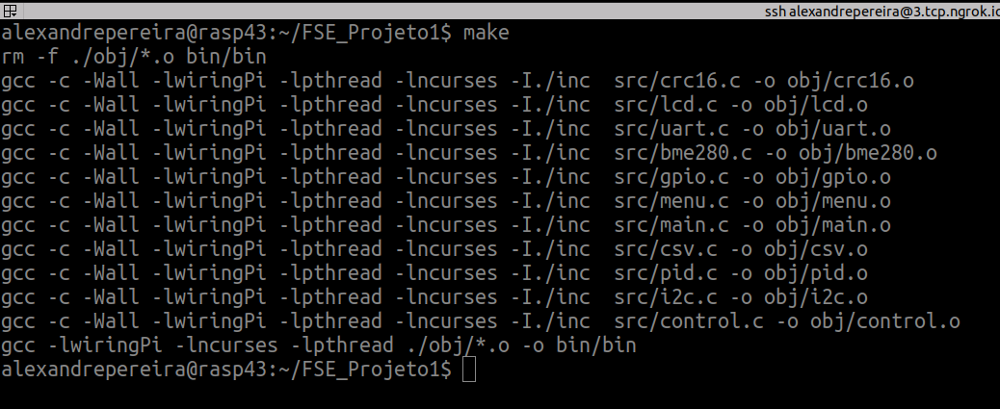

Após isso, aparecerá o terminal interativo, com a atualização - em média a cada 1 segundo - dos dados obtidos pelo sistema, bem como o estado da ventoinha e do resistor.

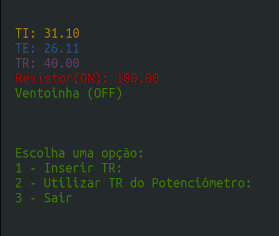

O Menu contém 3 opções, sendo elas:

### **1 - Inserir TR**

* Quando o usuário digitar o número correspondente, acionará uma segunda tela para obter a nova **Temperatura de Referência (TR)**, que deve estar em uma faixa entre a **Temperatura Externa (TE)** medida no momento e 100 °C

#### **Inserção de Valor Válido**
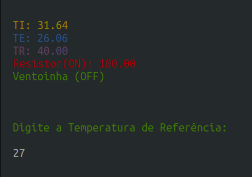

#### **Atualização da Temperatura de Referência (TR)**
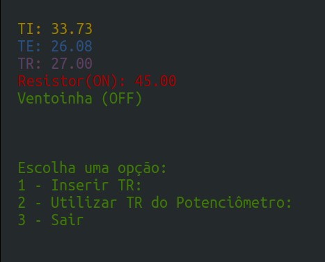


* Caso o número esteja em uma faixa de valor fora do aceitável, uma mensagem de erro aparecerá, informando o usuário que o valor é inválido e requisitando uma nova inserção

#### **Inserção de Valor Inválido**
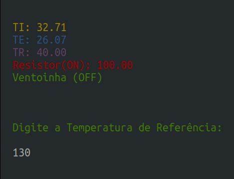

#### **Mensagem de Erro**
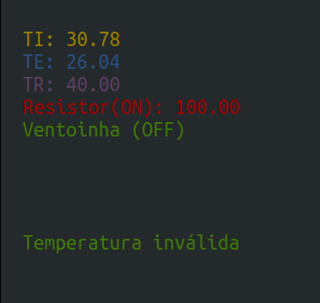


### **2 - Utilizar TR do Potenciômetro**

* Que passará a utilizar a **Temperatura de Referência (TR)** equivalente à lida pelo potenciômetro

#### **Escolha da Segunda Opção**
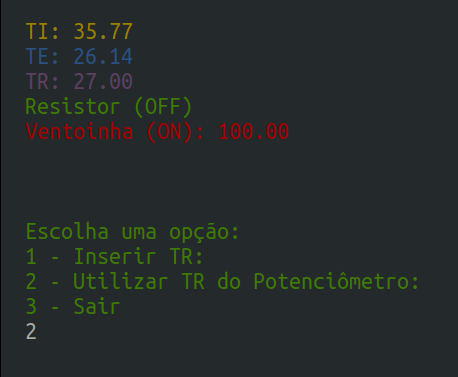

#### **Atualização do Valor da Temperatura de Referência (TR)**
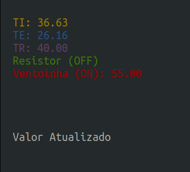


#### **3 - Sair**
Que encerrará o sistema, bem como as conexões gerais e desligará a ventoinha e o resistor. Caso o usuário envie um sinal para encerrar o processo, como um ```ctrl+c``` ocorrerá o mesmo efeito de encerramento, porém acionado de forma assíncrona.

#### **Atualização do Valor da Temperatura de Referência (TR)**
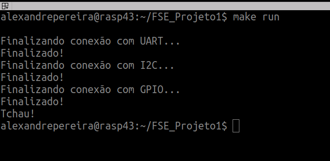

## Resultados 

Ao executar o programa por 10 minutos, foram obtidos os segunites resultados do sistema de controle:

### Temperatura

Ao longo do período de 10 minutos, a **Temperatura Interna (TI)** foi alterada de acordo com o valor indicado pela **Temperatura de Referência (TR)** obtida pelo potenciômetro, nao ultrapassando a **Temperatura Externa (TE)** que se referia à temperatura ambiente no local de execução do Experimento. Disponível de forma interativa [neste link.](https://docs.google.com/spreadsheets/d/e/2PACX-1vQ2pO4nidKkPTHUo80zplJlwaMVJmhb1CUBl7UyeOSn5QEIT1ZQySVc4I6oc-JhnVLmQMwHwXTTW1Zp/pubchart?oid=1356807590&format=interactive)

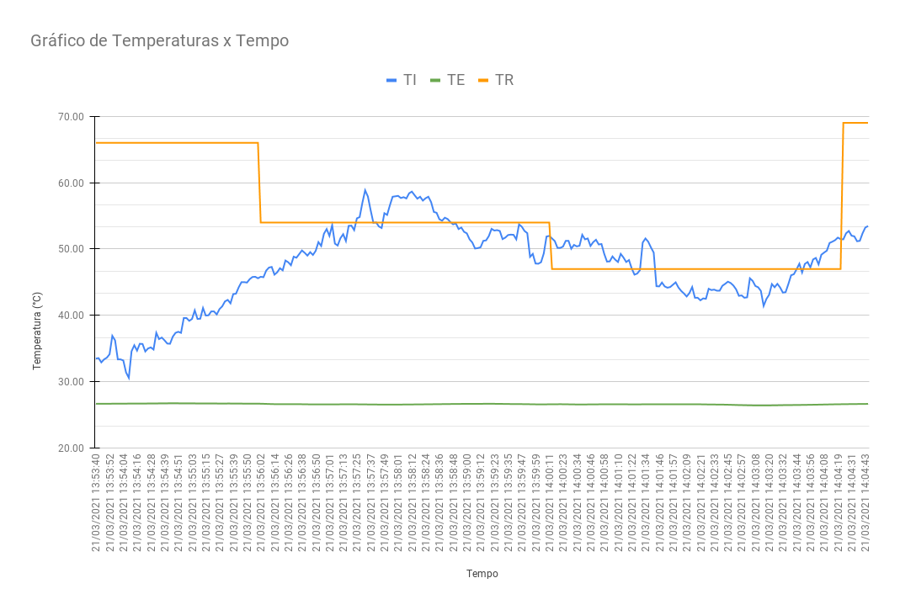

### Ventoinha e Resistor

Nesse mesmo período de tempo é Interessante observar o gráfico de acompanhamento do Resistor e da Ventoinha, observando como a intensidade de acionamento (em Módulo) desses elementos indicaram a tendência de modificação da temperatura ao longo do tempo [neste link.](https://docs.google.com/spreadsheets/d/e/2PACX-1vQ2pO4nidKkPTHUo80zplJlwaMVJmhb1CUBl7UyeOSn5QEIT1ZQySVc4I6oc-JhnVLmQMwHwXTTW1Zp/pubchart?oid=1138730300&format=interactive)

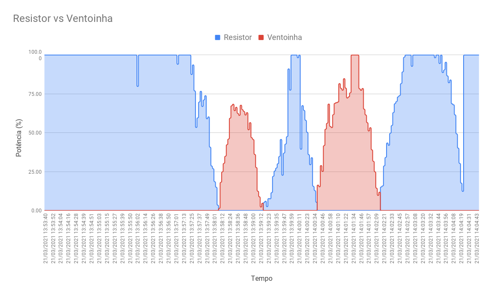

### Geral

De uma forma geral, é possível notar o funcionamento do sistema ao se comparar os valores absolutos em um mesmo gráfico, ainda que com um excesso de informações, mostrando como a atuação tanto do resistor quanto da ventoinha influenciaram no sistema e com que intensidade ocorreu essa influência. Disponível de forma [neste link.](https://docs.google.com/spreadsheets/d/e/2PACX-1vQ2pO4nidKkPTHUo80zplJlwaMVJmhb1CUBl7UyeOSn5QEIT1ZQySVc4I6oc-JhnVLmQMwHwXTTW1Zp/pubchart?oid=2049566771&format=interactive)


## Referências

- [PID - Wikipedia](https://pt.wikipedia.org/wiki/Controlador_proporcional_integral_derivativo)  
- [Driver da Bosh para o sensor BME280](https://github.com/BoschSensortec/BME280_driver)  
- [Biblioteca BCM2835 - GPIO](http://www.airspayce.com/mikem/bcm2835/)  
- [Controle do LCD 16x2 em C](http://www.bristolwatch.com/rpi/i2clcd.htm)  
- [Biblioteca WiringPi GPIO](http://wiringpi.com)  
- [PWM via WiringPi](https://www.electronicwings.com/raspberry-pi/raspberry-pi-pwm-generation-using-python-and-c)

