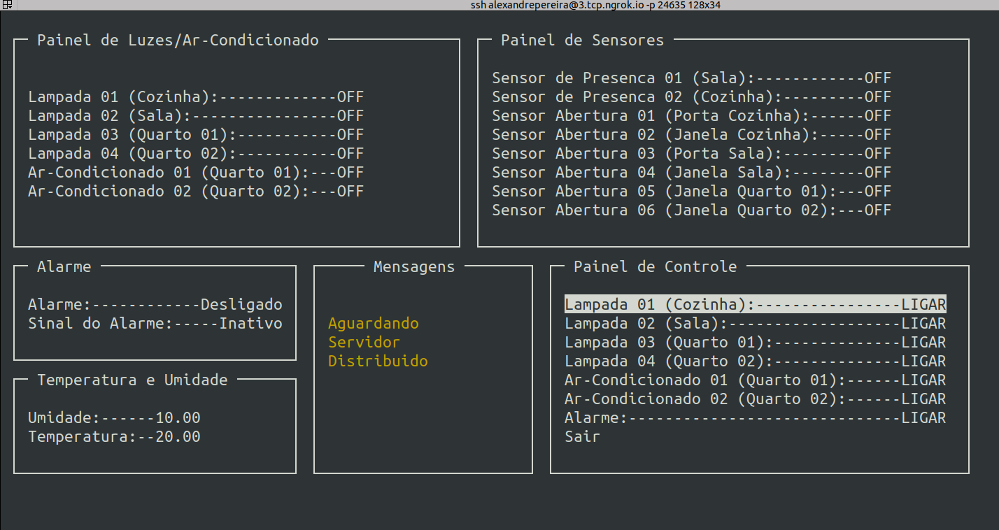

# FSE_Projeto2

## Dados

| Aluno | Matrícula |
| --- | --- |
| Alexandre Miguel Rodrigues Nunes Pereira | 16/0000840 |

## Introdução

O Projeto em questao busca realizar a implementação de um sistema de controle de um ambiente inteligente, como uma casa, contando com um **Servidor Central** que coordena um **Servidor Distribuido** através de uma conexão TCP com Sockets, enviando comandos para requisitar a temperatura e a umidade do local, acionando lâmpadas e ar condicionados, identificando a ativação de sensores de presença e como descrito no repositório do projeto em [https://gitlab.com/fse_fga/projetos_2020_2/projeto-2-2020.2](https://gitlab.com/fse_fga/projetos_2020_2/projeto-2-2020.2).

## Dependências

* [WiringPi](http://wiringpi.com/)
* [ncurses](https://invisible-island.net/ncurses/announce.html)

## Execução

Para executar o programa basta clonar o repositório presente, em cada uma das RASPs utilizadas para o projeto e executar os seguintes comandos. **Atencão:** ***Deve ser executado primeiro o Servidor Central e somente depois o Servidor Distribuido***

### Servidor Central

``` bash
# Clone do repositório
$ git clone https://github.com/aleronupe/FSE_Projeto2

# Vá para o diretório do projeto
$ cd FSE_Projeto2/serv_central/

# Relize o build o projeto
$ make

# Inicie a execução
$ make run
```

Com a execução do comando ```make``` é esperado o seguinte resultado:


Após isso, aparecerá o terminal interativo, com a atualização - em média a cada 1 segundo - dos dados de temperatura sendo obtidos através da conexão com o servidor distribuido, quando estabelecida.




#### ***Painel de Controle***

O Menu contém com um painel de controle seletor de opções, indicado no canto inferior direito, sendo essas opções atualizadas dinâmicamente de acordo com o estado do dispositivo que o usuário deseja acionar:


Para navegar no menu, basta utilizar as setas para cima <kbd>&#8593;</kbd> e para baixo <kbd>&#8595;</kbd>  e, ao desejar selecionar a opção marcada, basta o usuário apertar a tecla <kbd>Enter</kbd> 

#### ***Alarme***

Para que o Sinal do Alarme possa ser tocado caso algum sensor de presença seja ativado (sendo identificados somente após sua ativação) é necessário que o usuário selecione a opção de ligar o alarme, que refletirá no seu estado no campo ***Alarme*** na caixa no canto esquerdo, ao centro.


Assim, caso algum sensor de presença seja ativado após o acionamento do alarme, o sinal será ativado. O sinal voltará a ser desativado quando o alarme for desligado. 


#### **Sair**
Ao selecionar a opção de ```Sair``` as conexões lógicas e sockets serão encerradas e o programa retornará ao terminal


### Servidor Distribuído

``` bash
# Clone do repositório
$ git clone https://github.com/aleronupe/FSE_Projeto2

# Vá para o diretório do projeto
$ cd FSE_Projeto2/serv_distribuido/

# Relize o build o projeto
$ make

# Inicie a execução
$ make run
```
Com a execução do comando ```make``` é esperado o seguinte resultado:


Após isso, aparecerão mensagens informando acerca dos estados e conexões realizadas entre o **Servidor Central** e o **Servidor Distribuído**


#### **Sair**
Ao se acionar o comando ```Ctrl + C``` as conexões lógicas e sockets serão encerradas e o programa retornará ao terminal, informando isso em tela


## Referências

- [Driver da Bosh para o sensor BME280](https://github.com/BoschSensortec/BME280_driver)  
- [Biblioteca BCM2835 - GPIO](http://www.airspayce.com/mikem/bcm2835/)    
- [Biblioteca WiringPi GPIO](http://wiringpi.com)  
- [PWM via WiringPi](https://www.electronicwings.com/raspberry-pi/raspberry-pi-pwm-generation-using-python-and-c)

